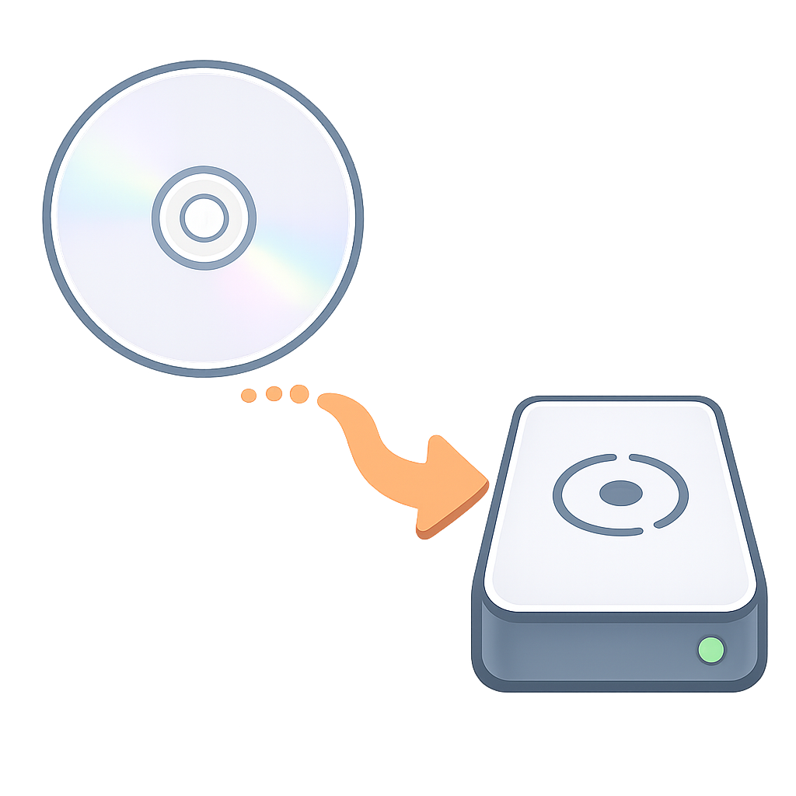
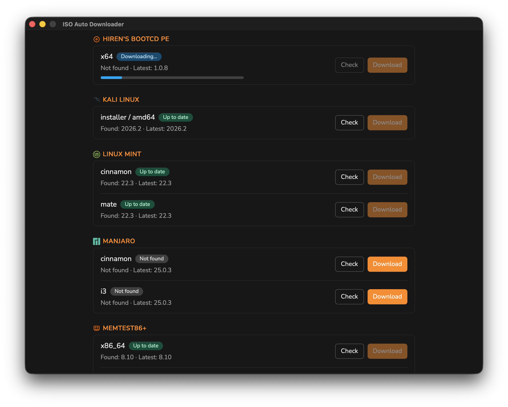
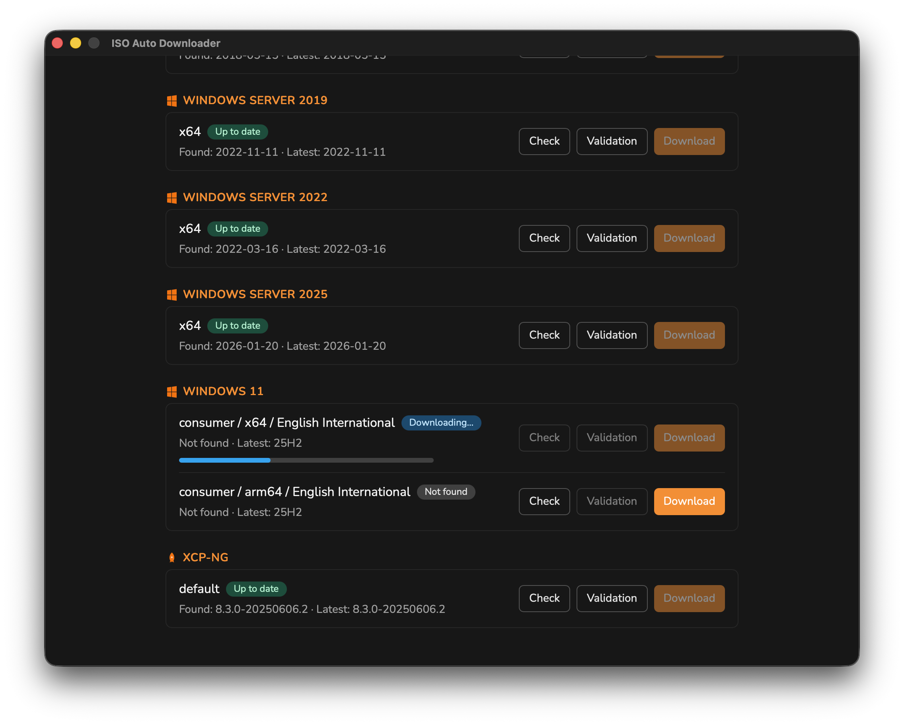
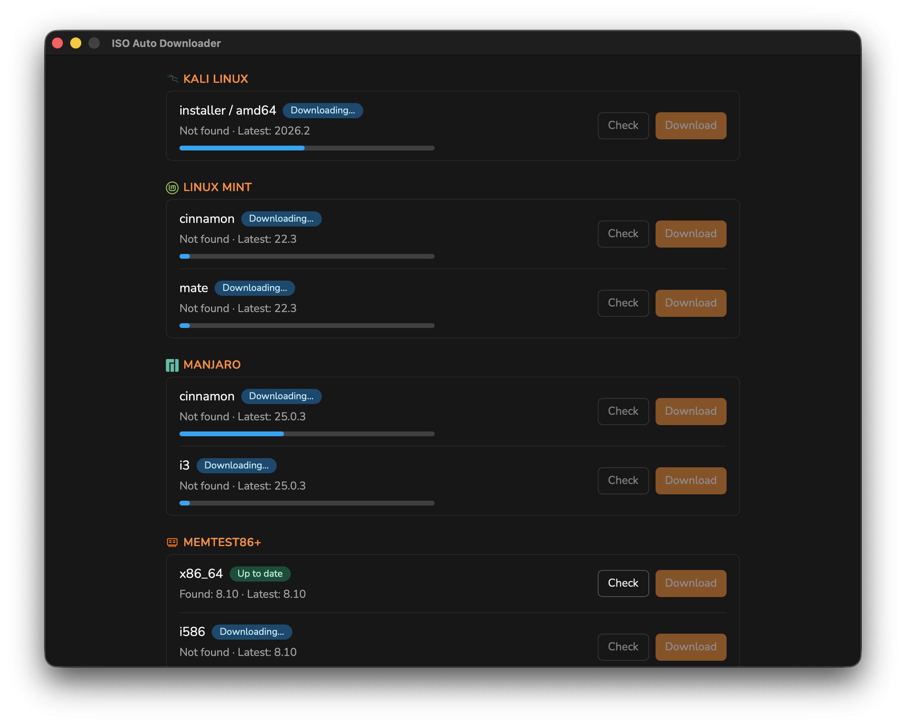
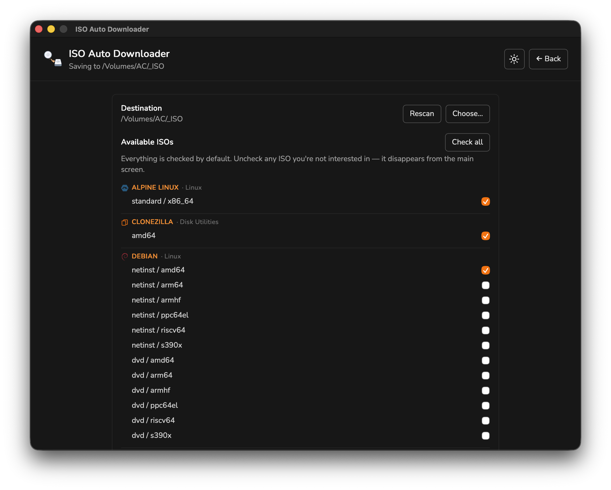
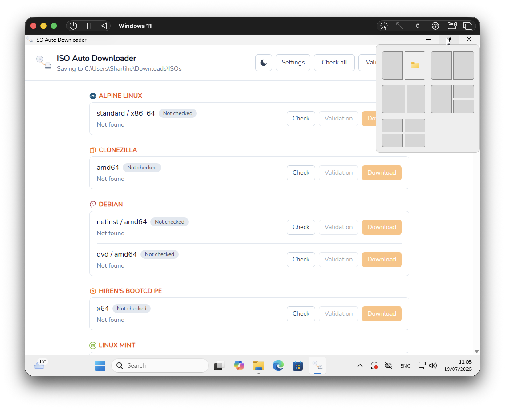

# ISO Auto Downloader

<p align="center">
  
</p>

<p align="center">
  <strong>A native desktop app for macOS and Windows</strong><br />
  Check, download, and verify the latest ISO images for Linux distributions,
  Windows, diagnostic tools, and disk utilities.
</p>

<p align="center">
  
  
  
</p>

## 👀 What it looks like

<p align="center">
  
</p>

<p align="center">
  
</p>

<p align="center">
  
</p>

<p align="center">
  
</p>

<p align="center">
  
</p>

## ✨ Why this project exists

As a sysadmin, I have a Zalman disk ready to install or diagnose systems but maintaining a updated ISO was really time consuming. I wanted a nice and easy solution for this.

Keeping your bootable ISOs up to date is often a manual and repetitive task. This app aims to make it simple:

- discover supported ISO sources
- check whether a newer version is available
- download the latest file safely
- verify integrity with checksums and signatures when available
- keep everything organized in a single desktop experience

## 🚀 Key features

- Native desktop UI built with Go and Wails
- Support for major Linux distributions, Windows images, and recovery tools
- Automatic version checks and status reporting
- Download progress tracking for individual or bulk updates
- Atomic file replacement to avoid leaving partial downloads behind
- Configurable storage paths, categories, and preferences
- Logging and diagnostics for troubleshooting

## 📦 Installation

### macOS

#### Homebrew

```bash
brew install --cask arnaudcharles/tap/iso-auto-downloader
```

Or download a release artifact from [GitHub Releases](https://github.com/arnaudcharles/iso-auto-downloader/releases).

### Windows

#### Scoop

If you use Scoop, you can install it with:

```powershell
scoop bucket add arnaudcharles https://github.com/arnaudcharles/scoop-bucket
scoop install arnaudcharles/iso-auto-downloader
```

#### Chocolatey

You can also install it from Chocolatey:

- [iso-auto-downloader 0.1.0 on Chocolatey Community](https://community.chocolatey.org/packages/iso-auto-downloader/0.1.0)

Or download a release artifact from [GitHub Releases](https://github.com/arnaudcharles/iso-auto-downloader/releases).

### Build from source

If you want to try the app locally:

```bash
go install github.com/wailsapp/wails/v2/cmd/wails@latest
cd frontend
npm install
cd ..
wails dev
```

## 🛠️ How it works

The app follows a simple workflow:

1. Discover the available ISO sources
2. Check the latest version for each provider
3. Download the selected file if needed
4. Verify the downloaded payload
5. Store it in the configured destination folder

## 🧭 Project status

This repository is currently in active development. The first milestone focuses on a solid macOS MVP, with broader provider coverage and Windows packaging planned next.

## 🤝 Contributing

Contributions are welcome. Whether you want to improve the UI, add a new provider, or help with documentation, your input is valuable.

Please see [CONTRIBUTING.md](CONTRIBUTING.md) for guidelines.

## 📄 License

This project is licensed under the GPL-2.0-or-later license.
