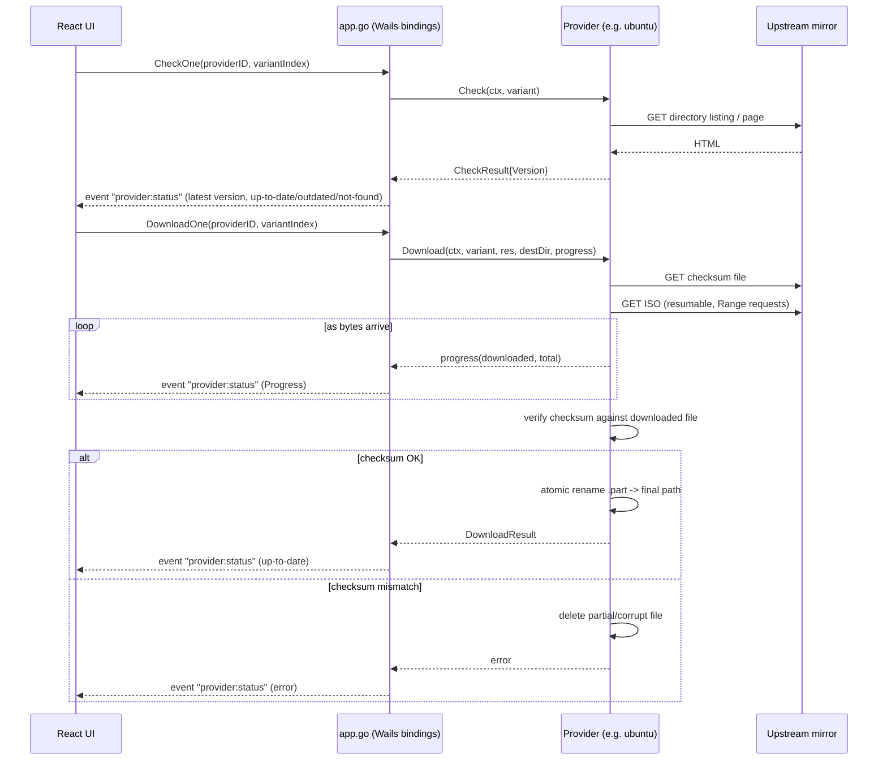

# Architecture

## Overview

ISO Auto Downloader is a [Wails](https://wails.io) app: a Go backend bound
to a React/TypeScript + Tailwind CSS frontend, packaged as a single native
`.app` with no external runtime dependency (no Python, no bundled Node).

```
main.go        — Wails entrypoint, embeds frontend/dist, binds App
app.go         — Wails-bound App struct: orchestrates providers, holds in-memory status, emits progress events
internal/
  provider/    — Provider interface + registry that native providers self-register into
    ubuntu/    — Ubuntu Desktop/Server (OVH mirror)
    debian/    — Debian netinst (cdimage.debian.org)
    memtest86plus/ — MemTest86+ (memtest.org, ships as zip)
  scrape/      — Shared HTML-directory-listing and checksum-file parsing helpers
  download/    — Resumable HTTP download, checksum verification, atomic file replace
  config/      — TOML config load/save
frontend/src/  — React UI: provider/variant list, status badges, check/download actions
```

## Provider interface

Every native ISO source implements `provider.Provider`
(`internal/provider/provider.go`):

```go
type Provider interface {
    ID() string
    Name() string
    Category() Category
    Variants() []Variant

    Check(ctx context.Context, v Variant) (CheckResult, error)
    Download(ctx context.Context, v Variant, res CheckResult, destDir string, progress ProgressFunc) (DownloadResult, error)
}
```

`CheckResult` intentionally carries nothing beyond a version string:
`Download` must be able to re-derive the download URL from `Version` alone.
This mirrors the contract that Step 2's script-backed custom providers will
have to satisfy too (a DOWNLOAD script only ever receives `ISOAD_VERSION`
from the CHECK step, per the custom-ISO spec) — so native and custom
providers can share the same `app.go` orchestration without special-casing.

Providers self-register from an `init()` function
(`provider.Register(MyProvider{})`), so adding a new ISO is purely
additive: a new package under `internal/provider/`, no changes to existing
code.

## Check → Download → Verify flow



Two invariants fall out of this design:

- **A failed or corrupted download never replaces a good existing file.**
  `internal/download` writes to `<dest>.part`, verifies the checksum against
  that temp file, and only then does `os.Rename` to the final path. On
  checksum mismatch the temp file is deleted and the error is surfaced —
  the previous file at `dest` (if any) is untouched.
- **Resume is safe.** If `<dest>.part` already exists, the next download
  attempt sends a `Range` request from that offset; if the server ignores
  the range and returns `200 OK` instead of `206 Partial Content`, the
  download restarts from scratch rather than corrupting the partial file.

## Found-version detection

Every provider implements `LocalVersion(filename string, v Variant) (version
string, ok bool)` — a pure function matching a bare filename against the
same pattern the provider uses when downloading, and extracting the version
encoded in it. `app.go`'s `scanForFoundVersions` recursively walks the whole
configured download folder (`filepath.WalkDir`), collects every filename,
and runs each one against every provider/variant's `LocalVersion`. This
happens on startup, whenever the destination folder changes, and on demand
via the "Rescan" button.

Deliberately not scoped to the exact `<Provider>/` subfolder this app
itself downloads into: a file placed anywhere under the destination
root — at any nesting depth, in a folder the user organized by hand — is
still detected, without needing an exact directory match.

## macOS distribution

The app isn't notarized (no paid Apple Developer account yet). The
recommended install path is a **Homebrew Cask**, because `brew install
--cask` strips the `com.apple.quarantine` extended attribute during
install — this is what actually suppresses the Gatekeeper "unidentified
developer" warning, not notarization itself. Direct downloads from GitHub
Releases remain available as a fallback, with a "right-click → Open" note
in the README for users who hit the Gatekeeper prompt.

GoReleaser (`.goreleaser.yaml`) packages `wails build` output for
`darwin/arm64` and `darwin/amd64` rather than compiling Go directly:
`wails build` needs to embed the compiled frontend and produce the `.app`
bundle, so it's the actual build step, and GoReleaser wraps it as a
[prebuilt](https://goreleaser.com/customization/builds/prebuilt/)/archive
pipeline rather than owning compilation.

## Adding a provider

See [CONTRIBUTING.md](../CONTRIBUTING.md).
